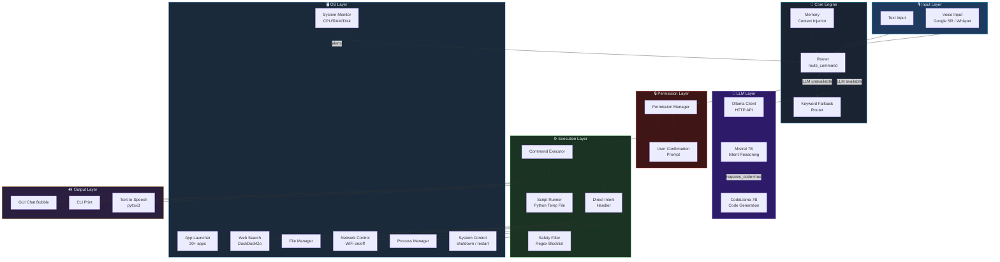
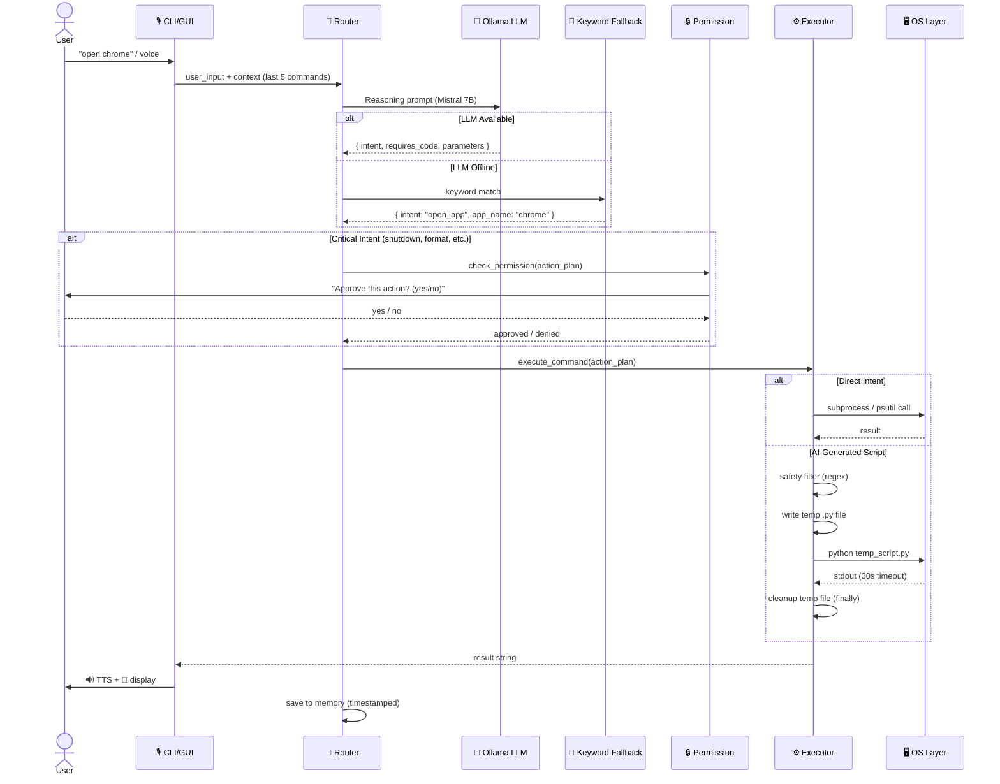
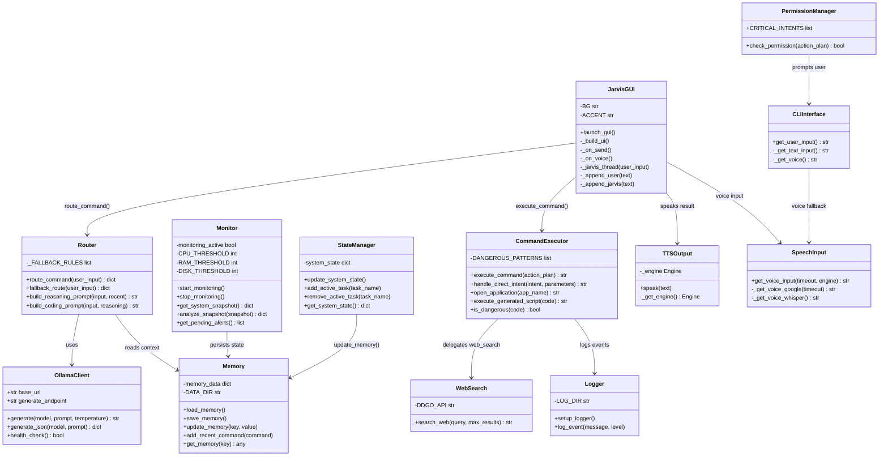
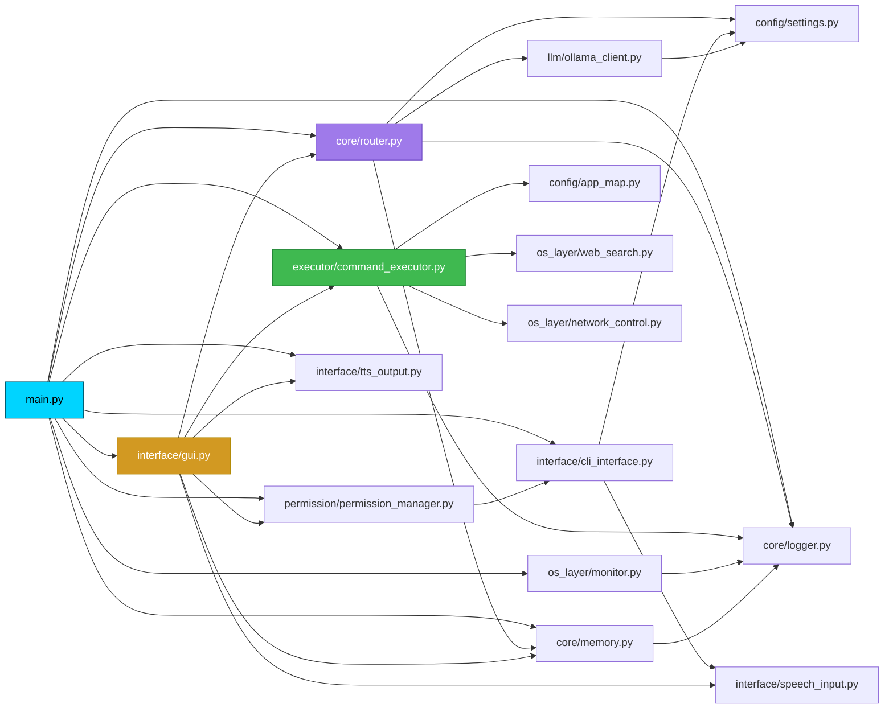
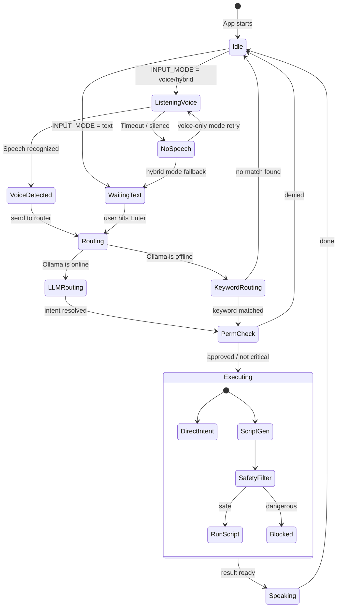

<div align="center">


<br/>

[](https://python.org)
[](https://ollama.ai)
[](https://mistral.ai)
[](LICENSE)
[](https://github.com/aryxn1233/JARVIS)

<br/>

> **"Just A Rather Very Intelligent System"**  
> A locally-running, voice-activated AI OS assistant powered by Mistral 7B and CodeLlama — no cloud, no subscriptions, pure local intelligence.

<br/>

[✨ Features](#-features) • [🚀 Quick Start](#-quick-start) • [🏗️ Architecture](#️-architecture) • [💻 Usage](#-usage) • [⚙️ Configuration](#️-configuration)

</div>

---

## ✨ Features

<table>
<tr>
<td width="50%">

### 🧠 AI-Powered Routing
- **Mistral 7B** understands natural language commands
- **CodeLlama 7B** generates executable Python scripts on-the-fly
- **Keyword fallback** — works even without Ollama running

</td>
<td width="50%">

### 🗣️ Voice-First Interface
- **Google Speech Recognition** (online)
- **OpenAI Whisper** (fully offline)
- Hybrid mode: voice first, text fallback

</td>
</tr>
<tr>
<td width="50%">

### 🖥️ Full GUI
- Dark-theme **tkinter chat interface**
- Real-time status indicator
- 🎤 voice button, 🗑️ clear, timestamps

</td>
<td width="50%">

### 🔍 Web Search
- **DuckDuckGo** Instant Answer API
- No API key required
- Returns abstracts, answers & related topics

</td>
</tr>
<tr>
<td width="50%">

### 🚀 App Launcher
- Open **30+ apps** by name
- `open chrome`, `launch vscode`, `start spotify`
- Fully customizable app map

</td>
<td width="50%">

### 🔒 Permission System
- Critical actions always require confirmation
- SAFE_MODE for non-critical actions
- Hardened regex-based script safety filter

</td>
</tr>
</table>

---

## 🚀 Quick Start

### Prerequisites

```bash
# Install Python 3.9+
# Install Ollama
winget install Ollama.Ollama          # Windows
curl -fsSL https://ollama.ai/install.sh | sh   # Linux
```

### Installation

```bash
# 1. Clone the repo
git clone https://github.com/aryxn1233/JARVIS.git
cd JARVIS/jarvis-ai

# 2. Install Python dependencies
pip install -r requirements.txt

# 3. Pull the AI models (one-time setup)
ollama pull mistral:7b-instruct-q4_K_M
ollama pull codellama:7b-instruct-q4_K_M

# 4. Start Ollama server
ollama serve
```

### Launch

```bash
# CLI mode (text + hybrid voice)
python main.py

# GUI mode (tkinter chat interface)
python main.py --gui
```

---

## 🏗️ Architecture

### System Architecture



---

### Command Flow Diagram



---

### Class Diagram



---

### Module Dependency Graph



---

### Input Mode State Machine



---

## 💻 Usage

### CLI / Voice Commands

```
You: check cpu                      → CPU Usage: 12% overall | Cores: [8, 5, ...]
You: how much RAM do I have         → RAM Usage: 61% | Used: 9.8 GB / Total: 16 GB
You: open chrome                    → Opening chrome.
You: search Python async tutorials  → 📖 Asyncio is a library...
You: clean temp files               → Cleanup complete. Freed 1.2 GB
You: shutdown                       → Approve? → System shutting down.
```

### GUI

```bash
python main.py --gui
```

| Button | Action |
|--------|--------|
| `Send ➤` or `Enter` | Send text command |
| `🎤` | Record voice command |
| `🗑️` | Clear chat history |

---

## ⚙️ Configuration

Edit `config/settings.py`:

```python
OLLAMA_URL        = "http://localhost:11434"   # Ollama server
REASONING_MODEL   = "mistral:7b-instruct-q4_K_M"
CODING_MODEL      = "codellama:7b-instruct-q4_K_M"

SAFE_MODE         = True     # Gate non-critical actions
INPUT_MODE        = "hybrid" # "text" | "voice" | "hybrid"
VOICE_ENGINE      = "google" # "google" | "whisper"
MEMORY_CONTEXT_SIZE = 5      # Commands injected into LLM context
GUI_MODE          = False    # True = launch GUI on startup
```

### Add Your Own Apps (`config/app_map.py`)

```python
APP_MAP = {
    "myapp": {"win": "myapp.exe", "linux": "myapp"},
    ...
}
```

### Enable Whisper (Offline Voice)

```bash
pip install openai-whisper sounddevice soundfile numpy
# then set VOICE_ENGINE = "whisper" in config/settings.py
```

---

## 📁 Project Structure

```
jarvis-ai/
├── main.py                    ← Entry point (CLI + GUI)
├── requirements.txt
│
├── config/
│   ├── settings.py            ← All configuration
│   ├── app_map.py             ← App name → executable map
│   └── permissions.yaml       ← Critical intents list
│
├── core/
│   ├── router.py              ← LLM routing + keyword fallback
│   ├── memory.py              ← Persistent JSON memory
│   ├── state_manager.py       ← Live system state
│   └── logger.py              ← Centralized logging
│
├── llm/
│   ├── ollama_client.py       ← HTTP client for Ollama
│   ├── reasoning_model.py     ← Mistral 7B wrapper
│   └── coding_model.py        ← CodeLlama 7B wrapper
│
├── executor/
│   ├── command_executor.py    ← Intent dispatch + script runner
│   ├── sandbox_runner.py      ← Safety validation
│   └── script_runner.py       ← Script execution helper
│
├── interface/
│   ├── cli_interface.py       ← Hybrid text/voice input
│   ├── tts_output.py          ← pyttsx3 text-to-speech
│   ├── speech_input.py        ← Google SR + Whisper
│   ├── gui.py                 ← Tkinter dark-theme GUI ✨
│   └── permission_prompt.py   ← User confirmation prompts
│
├── os_layer/
│   ├── monitor.py             ← Background resource monitor
│   ├── file_manager.py        ← File operations
│   ├── process_manager.py     ← Process listing
│   ├── network_control.py     ← WiFi toggle
│   ├── system_control.py      ← Shutdown / restart
│   └── web_search.py          ← DuckDuckGo search ✨
│
├── permission/
│   ├── permission_manager.py  ← Critical intent gating
│   └── privilege_escalation.py
│
├── workflows/
│   ├── automation_engine.py   ← Dynamic workflow dispatcher
│   ├── cleanup.py             ← Temp file cleanup
│   └── optimizer.py           ← Process optimizer
│
├── tests/
│   ├── test_executor.py       ← 10 executor tests
│   ├── test_permissions.py    ← 4 permission tests
│   └── test_router.py         ← 5 router tests
│
├── data/
│   └── memory.json            ← Persistent session memory
└── logs/
    └── jarvis.log             ← Full event log
```

---

## 🧪 Running Tests

```bash
python -m unittest discover -s tests -v
# Ran 19 tests in ~1s: OK
```

---

## 🛠️ Built With

| Component | Technology |
|-----------|-----------|
| Language | Python 3.9+ |
| AI Runtime | [Ollama](https://ollama.ai) |
| Reasoning LLM | Mistral 7B Instruct Q4 |
| Coding LLM | CodeLlama 7B Instruct Q4 |
| TTS | pyttsx3 (offline) |
| Voice Input | Google SR / OpenAI Whisper |
| GUI | tkinter (stdlib) |
| System Monitoring | psutil |
| Web Search | DuckDuckGo Instant Answer API |

---

## 🔮 Roadmap

- [ ] Plugin system for custom intent handlers
- [ ] GUI settings panel
- [ ] Multi-language TTS
- [ ] Home Assistant integration
- [ ] Conversation history export

---

## 👤 Author

**Aryan Thakur**  
GitHub: [@aryxn1233](https://github.com/aryxn1233)

---

<div align="center">

Made with ❤️ and ⚡ by Aryan Thakur

</div>
