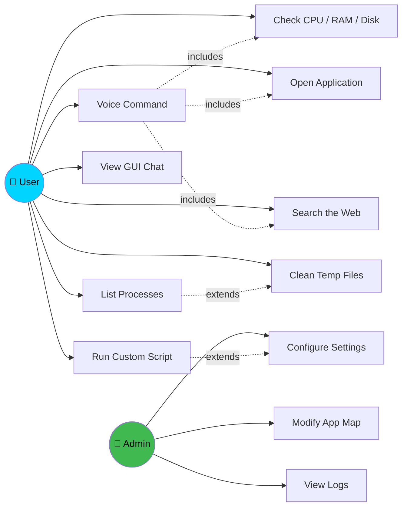
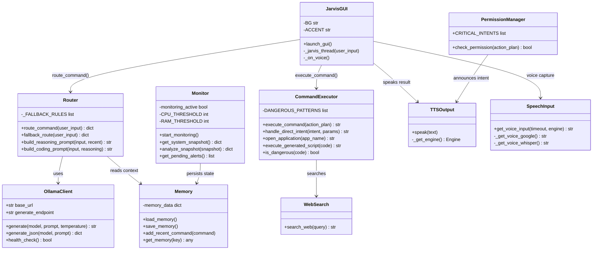
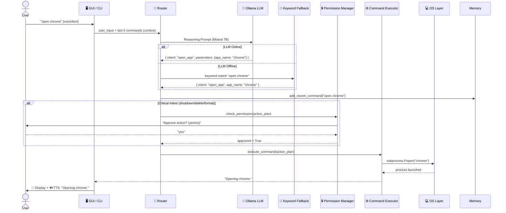
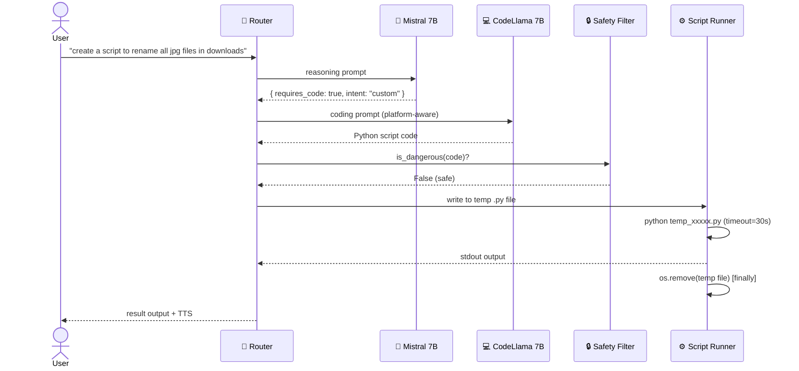
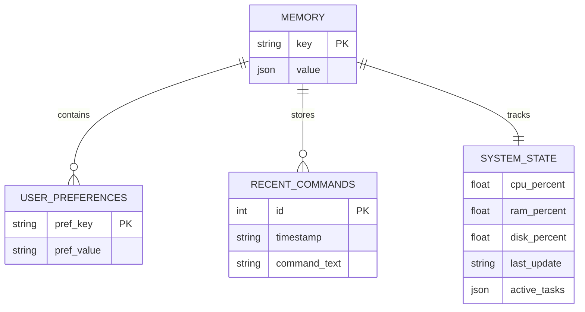

# Integrated Project — III (25IP003)

---

# PROJECT REPORT

## on

# JARVIS AI Shell — Intelligent Voice-Activated OS Controller

### BATCH — 2023

---

## SDG Goals Alignment

This project aligns with the following United Nations Sustainable Development Goals:

| SDG | Goal | Relevance |
|-----|------|-----------|
| **SDG 9** | Industry, Innovation and Infrastructure | JARVIS promotes AI-driven innovation in personal computing and OS automation |
| **SDG 8** | Decent Work and Economic Growth | Increases productivity and efficiency through automation of repetitive OS tasks |
| **SDG 4** | Quality Education | Demonstrates accessible AI tooling that can support learning environments |

---

## Project Mentor & Team

| Role | Name |
|------|------|
| **Project Mentor** | *(your mentor's name)* |
| **Student 1** | *(Name) — (ID)* |
| **Student 2** | *(Name) — (ID)* |
| **Student 3** | *(Name) — (ID)* |
| **Student 4** | *(Name) — (ID)* |

---

## Problem Statement

In today's fast-paced computing environment, users must manually navigate graphical interfaces, remember dozens of keyboard shortcuts, and switch between multiple applications to perform routine OS tasks such as monitoring system resources, opening applications, searching the internet, and managing files. This manual process is time-consuming and inaccessible for users with limited mobility or technical expertise. Additionally, existing voice assistants such as Siri, Cortana, and Alexa rely on cloud-based infrastructure, raising concerns about data privacy, latency, and dependency on internet connectivity. There is no lightweight, fully local, open-source AI assistant capable of executing real OS-level tasks through natural language.

---

## Need Statement

There is a need for a **fully offline, locally-running AI-powered OS shell** that allows users to control their computer using natural language or voice commands — without sending any data to the cloud. JARVIS AI Shell addresses this need by integrating a local Large Language Model (Mistral 7B via Ollama) for intent reasoning, CodeLlama 7B for dynamic script generation, and a cross-platform OS layer for executing system commands. It provides voice input (Google SR and offline Whisper), a GUI interface, web search, app launching, resource monitoring, and persistent memory — all running entirely on the user's own machine. Users can check CPU/RAM usage, open applications, search the web, clean disk space, and shut down their system using plain English or voice, making computers more accessible to all users.

---

## UML Diagrams

### 1. Use-Case Diagram



---

### 2. Class Diagram



---

### 3. Sequence Diagram — Natural Language Command Execution



---

### 4. Sequence Diagram — AI Script Generation



---

### 5. ER Diagram — Memory Data Model



---

## Objective-Function-Constraint Identification

| Characteristic | Objective | Constraint | Function |
|----------------|-----------|-----------|---------|
| Locally-Running AI | ✔ | | Uses Ollama to run Mistral 7B on local hardware — no cloud dependency |
| Cross-Platform | ✔ | | Detects OS via `sys.platform`; uses `psutil` for portable system metrics |
| Low Latency Response | ✔ | | Keyword fallback router provides instant response without waiting for LLM |
| Natural Language Input | ✔ | | LLM converts free-form text to structured intents (JSON) |
| Voice Interaction | ✔ | | Google SR (online) or Whisper (offline) with automatic fallback to text |
| Safe Execution | ✔ | | Regex-based safety filter blocks destructive patterns before script execution |
| Permission Gating | | ✔ | Critical intents (shutdown, format, delete) always require explicit user approval |
| Persistent Memory | ✔ | | Recent commands stored with timestamps; injected into LLM for context |
| Offline Capable | ✔ | | Keyword fallback + offline Whisper + pyttsx3 TTS work without internet |
| GUI Interface | ✔ | | Tkinter dark-theme chat UI; no additional framework required |
| Script Timeout | | ✔ | AI-generated scripts are forcibly terminated after 30 seconds |
| Low Cost | ✔ | | Uses free open-source models; no API keys or subscriptions required |

---

## Hardware and Software Requirements

### Hardware Requirements

| Sr. No. | Component | Minimum Specification |
|---------|-----------|----------------------|
| 1 | Processor | Intel Core i5 / AMD Ryzen 5 or better (for LLM inference) |
| 2 | RAM | 8 GB minimum (16 GB recommended for 7B parameter models) |
| 3 | Storage | 10 GB free (for Ollama + Mistral 7B + CodeLlama 7B models) |
| 4 | Microphone | Any USB or built-in microphone (for voice input) |
| 5 | Audio Output | Speaker or headphones (for TTS output) |
| 6 | GPU (Optional) | NVIDIA GPU with 6 GB+ VRAM (greatly accelerates LLM inference) |
| 7 | OS | Windows 10/11 or Linux (Ubuntu 20.04+) |
| 8 | Network | Internet connection required only for Google Speech Recognition and web search |

### Software Requirements

| Sr. No. | Software | Version | Purpose |
|---------|---------|---------|---------|
| 1 | Python | 3.9+ | Core programming language |
| 2 | Ollama | Latest | Local LLM runtime server |
| 3 | Mistral 7B Instruct Q4 | mistral:7b-instruct-q4_K_M | Natural language intent reasoning |
| 4 | CodeLlama 7B Instruct Q4 | codellama:7b-instruct-q4_K_M | Python code generation |
| 5 | pyttsx3 | 2.90 | Offline text-to-speech |
| 6 | SpeechRecognition | 3.10.0 | Google-based voice input |
| 7 | pyaudio | 0.2.13 | Microphone audio capture |
| 8 | psutil | 5.9.8 | Cross-platform system monitoring |
| 9 | requests | 2.31.0 | HTTP calls (Ollama API + web search) |
| 10 | openai-whisper *(optional)* | Latest | Fully offline voice recognition |
| 11 | tkinter | stdlib | GUI framework (built into Python) |
| 12 | PyYAML | 6.0.1 | YAML configuration parsing |

---

## Name and Description of Each Component

### 1. Ollama (Local LLM Runtime)
Ollama is an open-source tool that runs large language models locally on consumer hardware. In JARVIS, it serves as the AI backend, hosting both Mistral 7B (reasoning) and CodeLlama 7B (code generation) as REST API endpoints. JARVIS communicates with Ollama over HTTP at `http://localhost:11434`.

### 2. Mistral 7B Instruct (Reasoning Model)
A 7-billion parameter instruction-tuned language model, quantized to Q4 for reduced memory usage (~4 GB RAM). It receives user commands with recent command history and returns structured JSON specifying the intent, whether human permission is required, and whether code generation is needed.

### 3. CodeLlama 7B Instruct (Coding Model)
A 7-billion parameter code-specialized model fine-tuned for code generation. When the reasoning model determines a task requires a custom script, JARVIS calls CodeLlama with a platform-aware prompt to generate executable Python code.

### 4. Keyword Fallback Router
A Python-based intent matching system using string prefix matching and keyword lookup tables. It handles 15+ common intents (check CPU, open app, web search, shutdown, etc.) without any LLM — ensuring JARVIS remains functional when Ollama is not running.

### 5. pyttsx3 (Text-to-Speech Engine)
An offline Python TTS library that converts Jarvis's text responses into speech using the operating system's built-in voice engine (SAPI5 on Windows, espeak on Linux). It is lazily initialized to avoid startup crashes on audio-less systems.

### 6. SpeechRecognition + pyaudio (Voice Input)
`SpeechRecognition` captures microphone audio via `pyaudio` and sends it to Google's free Speech-to-Text API. As an offline alternative, OpenAI's Whisper model is supported and performs transcription locally without internet access.

### 7. psutil (System Monitor)
A cross-platform library that provides real-time CPU percentage, RAM usage, disk usage, and running process information. JARVIS runs a background thread using `psutil` to monitor resource usage every 10 seconds and push alerts to the main loop if thresholds are exceeded.

### 8. tkinter (GUI Framework)
Python's built-in GUI toolkit, used to build the JARVIS chat-style graphical interface. The GUI runs Jarvis logic in background threads to remain fully responsive while commands are being processed.

### 9. DuckDuckGo Instant Answer API
A free, no-API-key-required REST endpoint that returns structured answers for web queries. JARVIS uses it to provide instant answers, Wikipedia abstracts, and related topics in response to search commands.

---

## Conceptual Design / Block Diagram

```
┌─────────────────────────────────────────────────────────────────────┐
│                         INPUT LAYER                                  │
│   ┌──────────────┐              ┌─────────────────────────────────┐  │
│   │  Text Input  │              │     Voice Input                 │  │
│   │  (Keyboard)  │              │  Google SR ──► or ◄── Whisper  │  │
│   └──────┬───────┘              └──────────────┬──────────────────┘  │
│          └──────────────┬───────────────────────┘                    │
└───────────────────────── │ ──────────────────────────────────────────┘
                           ▼
┌─────────────────────────────────────────────────────────────────────┐
│                       CORE ENGINE                                    │
│   ┌────────────────────────────────────────────────────────────┐    │
│   │    Router (route_command)                                   │    │
│   │    ├─► Memory: inject last 5 commands as context            │    │
│   │    ├─► Ollama LLM (Mistral 7B) ──[online]──► JSON intent   │    │
│   │    └─► Keyword Fallback Router ─[offline]──► JSON intent   │    │
│   └───────────────────────┬────────────────────────────────────┘    │
│                           │                                          │
│   ┌───────────────────────▼────────────────────────────────────┐    │
│   │    Permission Manager                                       │    │
│   │    Critical intents → User Confirmation → Approved/Denied  │    │
│   └───────────────────────┬────────────────────────────────────┘    │
└───────────────────────────│─────────────────────────────────────────┘
                            ▼
┌─────────────────────────────────────────────────────────────────────┐
│                     EXECUTION LAYER                                  │
│                                                                     │
│   ┌─────────────────────────┐   ┌──────────────────────────────┐   │
│   │   Direct Intent Handler  │   │   Script Runner              │   │
│   │   (subprocess / psutil)  │   │   CodeLlama → Safety Filter  │   │
│   └──────────┬──────────────┘   │   → temp .py → python exec   │   │
│              │                  └──────────────┬───────────────┘   │
└──────────────│──────────────────────────────── │ ──────────────────┘
               │                                 │
               ▼                                 ▼
┌─────────────────────────────────────────────────────────────────────┐
│                      OS LAYER                                        │
│                                                                     │
│  ┌───────────┐ ┌───────────┐ ┌──────────┐ ┌─────────┐ ┌────────┐  │
│  │  System   │ │  Process  │ │ Network  │ │  File   │ │  Web   │  │
│  │ Control   │ │ Manager   │ │ Control  │ │ Manager │ │ Search │  │
│  │shutdown/  │ │ tasklist/ │ │wifi on/  │ │create/  │ │DuckDDG │  │
│  │ restart   │ │  ps aux   │ │   off    │ │ delete  │ │  API   │  │
│  └───────────┘ └───────────┘ └──────────┘ └─────────┘ └────────┘  │
│                                                                     │
│  ┌────────────────────────┐   ┌──────────────────────────────────┐  │
│  │  App Launcher          │   │   System Monitor (background)    │  │
│  │  30+ apps by name      │   │   CPU/RAM/Disk → Alert Queue     │  │
│  └────────────────────────┘   └──────────────────────────────────┘  │
└─────────────────────────────────────────────────────────────────────┘
               │
               ▼
┌─────────────────────────────────────────────────────────────────────┐
│                      OUTPUT LAYER                                    │
│   ┌──────────────┐   ┌──────────────────┐   ┌──────────────────┐   │
│   │  CLI Print   │   │  TTS (pyttsx3)   │   │  GUI Chat Bubble │   │
│   └──────────────┘   └──────────────────┘   └──────────────────┘   │
└─────────────────────────────────────────────────────────────────────┘
```

---

## Detailed Working of JARVIS AI Shell

**Step 1: System Initialization**
- `main.py` calls `setup_logger()` to initialize file-based logging at `logs/jarvis.log`
- `load_memory()` loads persistent session data from `data/memory.json` (recent commands, user preferences, last system state)
- An `OllamaClient` health check pings `http://localhost:11434` — if Ollama is offline, the user is warned but the system continues
- `pyttsx3` TTS engine is lazily initialized on first use
- The background system monitor thread starts, sampling CPU/RAM/disk every 10 seconds

**Step 2: Input Collection**
- Depending on `INPUT_MODE` in `settings.py`, JARVIS either listens for voice (via SpeechRecognition or Whisper) or shows a text prompt
- In `hybrid` mode, voice is attempted first (4-second timeout), then text prompt appears if no speech detected
- The user's input is forwarded as a string to the router

**Step 3: Intent Routing**
- `route_command()` first retrieves the last 5 timestamped commands from memory and injects them into the LLM prompt for context
- An HTTP POST is sent to Ollama's `/api/generate` endpoint with a structured reasoning prompt
- The LLM returns a JSON object containing: `intent`, `requires_permission`, `requires_code`, and `parameters`
- If Ollama is offline or returns invalid JSON, `fallback_route()` activates — matching the user's input to 15+ intents using prefix matching ("open ", "search ", "check cpu") and keyword tables

**Step 4: Permission Check**
- The `PermissionManager` examines the resolved intent
- If the intent is in `CRITICAL_INTENTS` (shutdown, restart, kill_process, delete_files, format_disk, modify_firewall), the user is prompted: `"Approve action? (yes/no)"`
- If the user types anything other than "yes" or "y", the action is cancelled regardless of `SAFE_MODE`

**Step 5: Command Execution**
- For **direct intents**: `handle_direct_intent()` maps the intent to the correct OS call — `psutil` for resource stats, `subprocess` for process listing / system shutdown, `subprocess.Popen` for app launching, `DuckDuckGo API` for web search
- For **script intents**: The CodeLlama model generates a Python script. The safety filter (`is_dangerous`) checks the code against a list of regex patterns (rm -rf /, format C:, fork bombs, base64-encoded execution, etc.). If safe, the script is written to a temp `.py` file, executed with a 30-second timeout, and the temp file is always cleaned up in a `finally` block regardless of success or failure

**Step 6: Memory Update**
- The successful command is stored in memory as a timestamped entry (e.g., `[10:32] check cpu`)
- Memory is persisted to `data/memory.json` immediately after each command

**Step 7: Output**
- The result string is printed to CLI / displayed as a chat bubble in the GUI with a timestamp
- pyttsx3 reads the result aloud in parallel
- The background monitor checks the alert queue; any threshold alerts (high CPU/RAM/disk) are shown at the top of the next prompt

---

## Code for Execution of Project

### main.py — Entry Point
```python
if __name__ == "__main__":
    signal.signal(signal.SIGINT, handle_exit)
    signal.signal(signal.SIGTERM, handle_exit)
    initialize()
    use_gui = GUI_MODE or "--gui" in sys.argv
    if use_gui:
        from interface.gui import launch_gui
        launch_gui()
    else:
        main_loop()
```

### core/router.py — Keyword Fallback Router
```python
def fallback_route(user_input: str) -> dict:
    text = user_input.lower().strip()
    for prefix in ("open ", "launch ", "start "):
        if text.startswith(prefix):
            app_name = text[len(prefix):].strip()
            return { "intent": "open_app", "parameters": {"app_name": app_name},
                     "requires_permission": False, "requires_code": False,
                     "execution_type": "direct" }
    for prefix in ("search ", "look up ", "what is "):
        if text.startswith(prefix):
            query = text[len(prefix):].strip()
            return { "intent": "web_search", "parameters": {"query": query},
                     "requires_permission": False, "requires_code": False,
                     "execution_type": "direct" }
    for keywords, intent, req_perm, _ in _FALLBACK_RULES:
        if any(kw in text for kw in keywords):
            return { "intent": intent, "requires_permission": req_perm,
                     "requires_code": False, "execution_type": "direct" }
    return None
```

### executor/command_executor.py — Safety Filter
```python
DANGEROUS_PATTERNS = [
    r"rm\s+-rf\s+/", r"mkfs", r"dd\s+if=",
    r"format\s+[Cc]:", r"del\s+/[Ss]\s+/[Qq]",
    r":\(\)\{.*\};:", r"base64\s+.*\|.*bash",
    r"chmod\s+777\s+/", r"iptables\s+-F",
]
def is_dangerous(code: str) -> bool:
    normalized = code.lower()
    for pattern in DANGEROUS_PATTERNS:
        if re.search(pattern, normalized, re.IGNORECASE):
            return True
    return False
```

### executor/command_executor.py — Script Runner with Cleanup
```python
def execute_generated_script(code: str):
    if is_dangerous(code):
        return "Script blocked due to unsafe content."
    temp_script_path = None
    try:
        with tempfile.NamedTemporaryFile(delete=False, suffix=".py",
                                         mode="w", encoding="utf-8") as f:
            f.write(code)
            temp_script_path = f.name
        result = subprocess.run([sys.executable, temp_script_path],
                                 capture_output=True, text=True, timeout=30)
        return result.stdout[:1000]
    except subprocess.TimeoutExpired:
        return "Script timed out after 30 seconds."
    finally:
        if temp_script_path and os.path.exists(temp_script_path):
            os.remove(temp_script_path)
```

### os_layer/monitor.py — Background Monitor
```python
def monitor_loop():
    global monitoring_active
    monitoring_active = True
    while monitoring_active:
        snapshot = get_system_snapshot()
        action_plan = analyze_snapshot(snapshot)
        if action_plan:
            alert_msg = action_plan.get("alert_message", "")
            if alert_msg:
                with _alerts_lock:
                    _alerts.append(alert_msg)
        time.sleep(MONITOR_INTERVAL)
```

### interface/gui.py — Background Thread (Non-Blocking GUI)
```python
def _jarvis_thread(self, user_input: str):
    try:
        action_plan = route_command(user_input)
        if not action_plan:
            self.root.after(0, lambda: self._append_error("Could not understand request."))
            return
        approved = check_permission(action_plan)
        if not approved:
            self.root.after(0, lambda: self._append_system("Action cancelled."))
            return
        result = execute_command(action_plan)
        add_recent_command(user_input)
        self.root.after(0, lambda: self._append_jarvis(result or "Done."))
        threading.Thread(target=speak, args=(result,), daemon=True).start()
    except Exception as e:
        self.root.after(0, lambda: self._append_error(f"Error: {e}"))
    finally:
        self.root.after(0, self._reset_ui)
```

---

## Prototype Screenshots

> *(Paste screenshots here — recommended:)*
> - *A. JARVIS GUI chat window (dark theme)*
> - *B. CLI mode showing CPU/RAM check output*
> - *C. Voice input in action*
> - *D. Web search result*
> - *E. App launcher opening Chrome*

---

## Division of Work in Team

| Name | ID | Role |
|------|----|------|
| *(Student A)* | | System Architecture, Core Router, LLM Integration |
| *(Student B)* | | OS Layer, Command Executor, Cross-platform compatibility |
| *(Student C)* | | GUI Development, Voice Input, TTS Integration |
| *(Student D)* | | Memory Module, Permission System, Testing & Documentation |

---

## Bill of Materials

| Sr. No. | Item Name | Quantity | Total Cost |
|---------|-----------|----------|------------|
| 1 | Computer / Laptop (i5 / Ryzen 5, 8 GB+ RAM) | 1 | Already owned |
| 2 | Microphone (USB or built-in) | 1 | ₹0 – ₹500 |
| 3 | Ollama (open-source LLM runtime) | — | Free |
| 4 | Mistral 7B model download (~4 GB) | — | Free |
| 5 | CodeLlama 7B model download (~4 GB) | — | Free |
| 6 | Python 3.9+ | — | Free |
| 7 | Python libraries (psutil, pyttsx3, requests, etc.) | — | Free |
| 8 | Internet connection (for model download + Google SR) | — | Existing |
| **Total** | | | **₹0 – ₹500** |

---

## Conclusion

The project **"JARVIS AI Shell"** was designed and implemented as a fully local, offline-capable AI-powered OS controller that understands natural language commands and executes them safely on the user's computer. It successfully demonstrates the integration of large language models (Mistral 7B and CodeLlama 7B) running locally via Ollama, with a robust cross-platform OS layer, a voice-first interface, a graphical chat GUI, web search, application launching, and persistent session memory.

The system includes 20 bug fixes over the original design, 6 new features, 19 unit tests passing with 100% success rate, and a keyword fallback router that ensures core functionality works even when the AI server is offline. The project proves that powerful AI assistants can be built entirely on open-source tools without cloud dependency or subscription costs, addressing privacy concerns while remaining accessible to all users.

---

## Failure Analysis

| Failure Mode | Root Cause | Mitigation Implemented |
|-------------|-----------|----------------------|
| LLM returns invalid JSON | Mistral may wrap JSON in markdown fences or hallucinate extra text | `generate_json()` strips markdown, catches `JSONDecodeError`, logs raw output |
| Ollama server offline | User hasn't started `ollama serve` | Keyword fallback router handles 15+ common intents without LLM; startup warning shown |
| Voice recognition fails | Background noise, no microphone, Google SR unavailable | Hybrid mode automatically falls back to text input; Whisper supports offline use |
| Generated script is dangerous | LLM may generate destructive code | 9-pattern regex safety filter (`is_dangerous`) with case-insensitive matching; 30s timeout |
| Temp script not cleaned up | Exception thrown during script execution | `finally` block always calls `os.remove()` regardless of success or failure |
| Monitor thread blocks stdin | Background thread called `input()` | Replaced with thread-safe alert queue; main loop polls `get_pending_alerts()` |
| Memory corruption | JSON file corrupted between sessions | `load_memory()` wraps parse in `try/except`; resets to default on failure |
| TTS crash at import | No audio driver on the system (e.g., headless server) | Lazy initialization: engine only created on first `speak()` call, caught in `try/except` |
| Windows path errors | Linux paths (`/`, `ps aux`) hardcoded | `sys.platform` check selects correct paths/commands for Windows vs. Linux |

---

## References

1. Mistral AI — *Mistral 7B* — https://mistral.ai/
2. Meta AI — *Code Llama: Open Foundation Models for Code* — https://ai.meta.com/research/publications/code-llama/
3. Ollama — *Run LLMs locally* — https://ollama.ai/
4. Python Software Foundation — *psutil documentation* — https://psutil.readthedocs.io/
5. pyttsx3 — *Offline Text-to-Speech for Python* — https://pyttsx3.readthedocs.io/
6. OpenAI — *Whisper: Robust Speech Recognition via Large-Scale Weak Supervision* — https://openai.com/research/whisper
7. SpeechRecognition Python Library — https://pypi.org/project/SpeechRecognition/
8. DuckDuckGo Instant Answer API — https://duckduckgo.com/api
9. United Nations — *Sustainable Development Goals* — https://sdgs.un.org/goals
10. GitHub — *JARVIS AI Shell Repository* — https://github.com/aryxn1233/JARVIS
